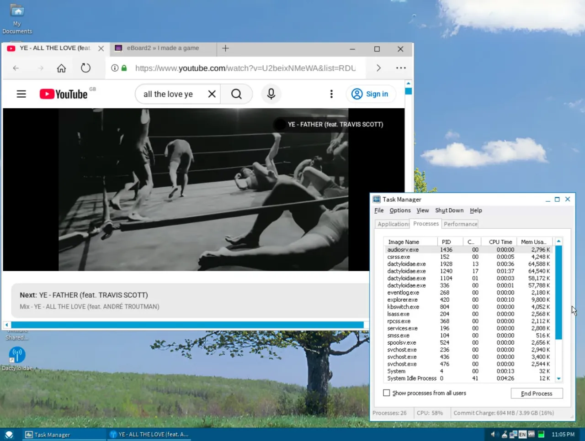

<!-- Screenshots will be added here -->
<!--  -->

Michirube is a rebranded build of the Unified XUL Platform (UXP), a Pale Moon lineage browser, distributed by the Mapel.

This repository contains the UXP source code with Michirube branding applied:
- Product name: **Michirube**
- Owner: **Mapel / QuantumMapleQC**
- Website: https://tsubakiproject.qzz.io
- Custom icons and branding
- Local "Get Add-ons" page with links to Pale Moon Add-ons, Basilisk Add-ons, and Classic Add-ons Archive
- Firefox compatibility UA version: 115.0

## Building

Requirements:
- Linux (tested on Ubuntu/Debian)
- Python 2.7
- Build dependencies: `build-essential`, `python2`, `libgtk-3-dev`, `libx11-dev`, `libxext-dev`, and others

Quick build:
```bash
./mach build
```

The binary will be at `obj-michishirube/dist/bin/michirube` (and `michirube-bin`).

### Installable .deb package

After a successful build, create an installable package:
```bash
# From repo root
./mach build
# The .deb can be built from obj-michishirube/dist/bin/ using the packaging scripts
```

A pre-built Beta package is available on the [Releases page](https://github.com/Michirube-Browser/UXP/releases/tag/v52.9.0-beta1).

## Add-ons

Michirube includes a local "Get Add-ons" page (`about:addons` → Get Add-ons) with three repositories:
- **Basilisk Add-ons Site** — Official Basilisk extensions
- **Classic Add-ons Archive** — Catalog of classic Firefox extensions
- **Pale Moon Add-ons** — Extensions for Pale Moon (https://addons.palemoon.org/extensions/)

## Supported Platforms

- Linux (x86_64) — Primary target, tested
- Windows — Should build (not actively tested)
- Windows 7/8/Vista/XP - Should fix (not actively tested)
- macOS — Should build (not actively tested)
- Android — Should build (not actively tested)
- IOS — Should build (not actively tested)

## Project Structure

This is a UXP (Unified XUL Platform) repository with Michirube branding applied. The source is organized as:

- `browser/` — Browser frontend (Michirube branding in `browser/branding/unofficial/`)
- `toolkit/` — Toolkit components (including the local discover page at `toolkit/mozapps/extensions/content/mozapps-discover/`)
- `toolkit/mozapps/webextensions/` — WebExtensions support
- `toolkit/mozapps/extensions/` — Add-on manager
- `toolkit/content/` — Shared content
- `browser/app/profile/basilisk.js` — Profile preferences (discoverURL points to local page)

## Configuration

Key configuration files:
- `mozconfig` — Build configuration
- `browser/branding/unofficial/configure.sh` — Branding configuration
- `browser/app/profile/basilisk.js` — Profile preferences
- `toolkit/mozapps/webextensions/jar.mn` — Chrome manifest (includes local discover page)

## License

This project is based on UXP, which is licensed under the Mozilla Public License 2.0. See `LICENSE` for details.

## Credits

- **Tsubaki Project** — Michirube rebranding and distribution 
- **Mapel** — Compiling and Building the entire source code for Linux + Windows
- **Palemoon Developers** — For supporting and maintaining Palemoon
- **Basilisk-Dev** — For supporting and maintaining Basilisk
- **Moonchild Productions** — For creating the Unified XUL Platform and Basilisk
- **Mozilla Developers** — Firefox ESR 52/60 browser base
- **.whatdidyouexpect** — Building MacOS Compiler / Executor 

---

*Michirube is released by the Tsubaki Project. Website: https://tsubakiproject.qzz.io*
